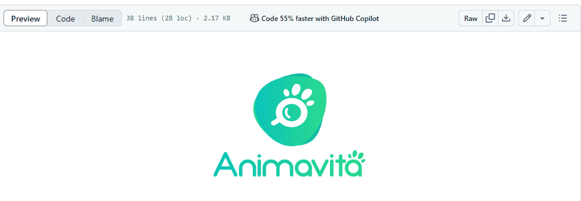

# # Proheto com README
Um projeto de teste com um arquivo README
🚀
[](https://google.com)

## Tecnologias utilizadas
-CSS
-HTML
-JS

## Como Utilizar

Clone pro projeto
```
git clone <url>
```
2 - Acesse a pasta do projeto
```
cd repositorio-com-readme
```